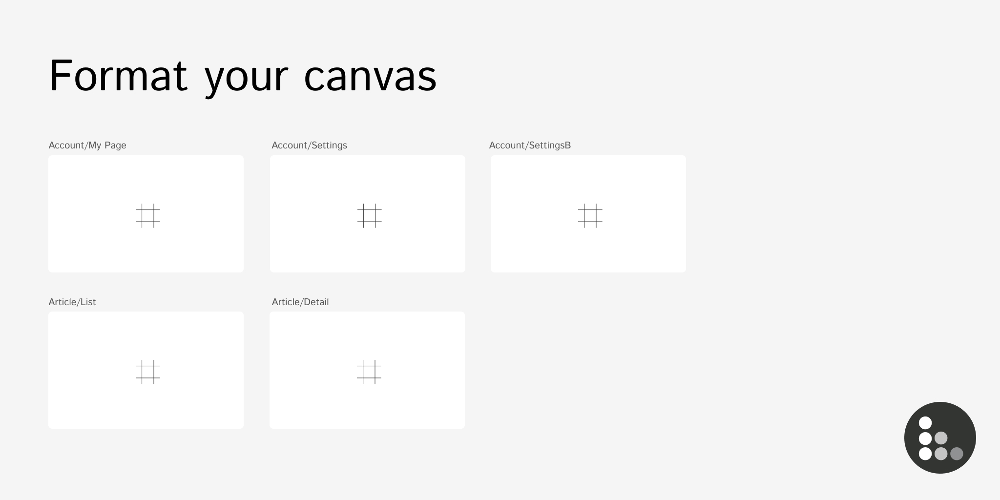
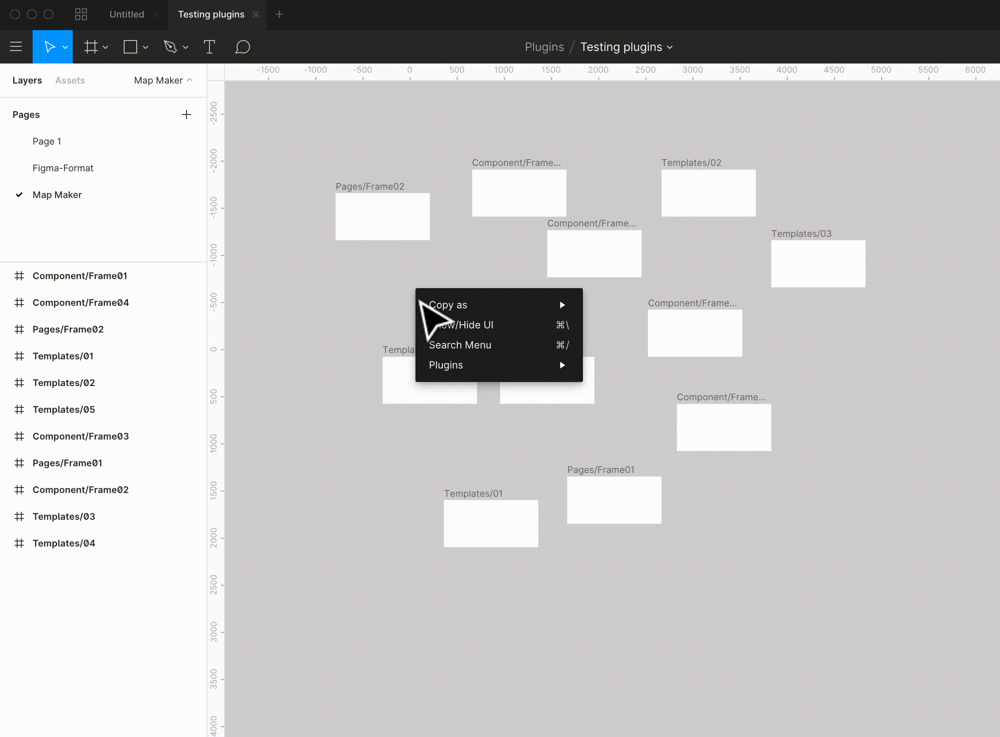

# Figma Format

Figma Format let's you format your canvas by grouping them by the names.

[](LICENSE)



## Usage

It will check the names of each layer and group them by the text before the separator (/) and layout nicely by their groups.



## Installation

https://www.figma.com/c/plugin/732774680197470712/Figma-Format

## Contributing

Pull requests are welcome. For major changes, please open an issue first to discuss what you would like to change.

#### Development

```bash
yarn watch
```

## Licence
MIT